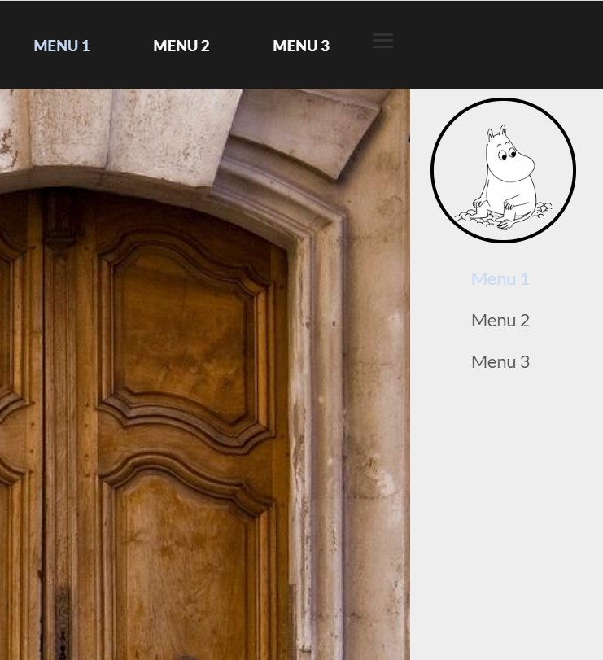
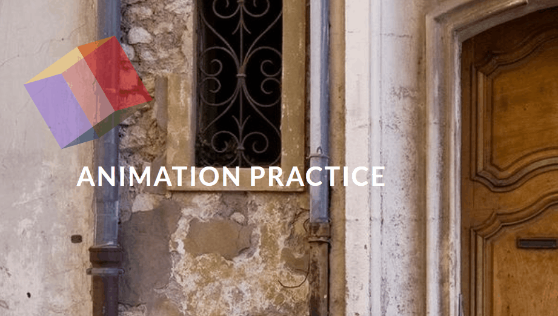
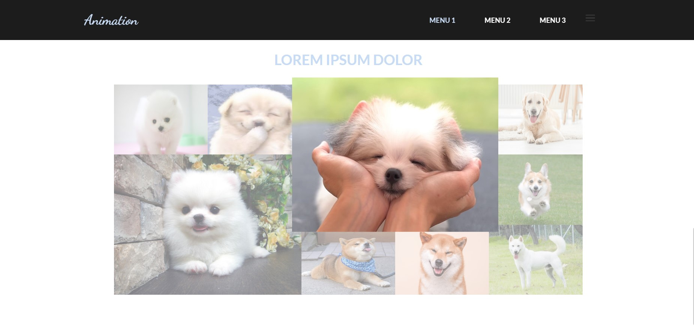

# CSS Transition, Transform, Animation

<details>
<summary>목차</summary>

- [과제 주제 설명](#과제-주제-설명)
- [주요 코드 설명](#주요-코드-설명)
  - [side-menu](#side-menu)
  - [banner](#banner)
  - [images](#images)
- [비고 및 고찰](#비고-및-고찰)

</details>

<br>

## 과제 주제 설명

5주차에 배운 transition, transform, animation 내용을 활용하여, 기존에 레이아웃을 잡은 웹 페이지를 업데이트 하는 것

<br>
<br>

## 주요 코드 설명

<br>

### side-menu



```css
#side-menu {
  position: fixed;
  top: 85px; /* 헤더 밑에 이어지게 아래로 내려줌 */
  right: 0; /* 오른쪽에 붙게 해줌 */
  bottom: 0;
  border-right: 1px solid #ddd;
  background-color: #eee;
  width: 200px;
  padding: 10px 20px;
  box-shadow: 1px 0 2px rgba(0, 0, 0, 0.4);
  transition-duration: 500ms; /* 전환 속도 */
  z-index: 10000;
}

#side-menu.hidden {
  right: -100%; /* 숨겨진 상태에서는 오른쪽 바깥으로 보냄 */
}
```

자바스크립트를 사용해 메뉴 버튼을 누르면 side-menu의 hidden을 넣고 빼고 해주면서 side-menu를 보이게/안보이게 할 수 있다.

<br>
<br>

### banner



```css
@keyframes sunday {
  /* 자연스럽게 이동되게 5단계로 나누어 한바퀴 돌게 지정 */
  0% {
    left: 0px;
    top: 0px;
  }
  25% {
    left: 500px;
    top: 0px;
  }
  50% {
    left: 500px;
    top: 200px;
  }
  75% {
    left: 0px;
    top: 200px;
  }
  100% {
    left: 0px;
    top: 0px;
  }
}

.wrapper {
  width: 100px;
  height: 100px;
  position: relative;
  transform: rotateX(45deg) rotateY(45deg) rotateZ(45deg); /* x, y, z 축을 45deg만큼 돌려줌 */
  transform-style: preserve-3d; /* 3차원으로 보이게 */
  animation: sunday 4s 2 alternate-reverse; /* sunday 효과를 4초동안 진행하고 2번 반복하며 양방향으로 움직임 */
}

.face {
  width: 100px;
  height: 100px;
  position: absolute;
  left: 0; /* 왼쪽에 붙게 */
  top: 0; /* 상단에 붙게 */
  opacity: 0.3; /* 불투명도 지정 */
}

.face:nth-child(1) {
  transform: rotateY(0deg) translate3d(0px, 0px, 50px);
  background-color: red;
}

... /* 정육면체 각각의 면에 transform 속성을 입히고 배경색 지정 */

.face:nth-child(6) {
  transform: rotateX(270deg) translate3d(0px, 0px, 50px);
  background-color: pink;
}
```

<br>
<br>

### images



```css
.images {
  display: grid; /* 그리드 방식으로 배치 */
  width: 1000px;
  grid-template-columns: repeat(5, 200px); /* 열의 갯수, 크기 지정 */
  grid-auto-rows: 150px; /* 행의 크기 지정 */
  grid-auto-flow: row dense; /* 모든 행을 빈칸없이 채워줌 */
  margin: 0 auto;
}

.images img {
  width: 100%;
  height: 100%;
  transition-duration: 500ms; /* 전환 속도 지정 */
  opacity: 0.5; /* 불투명도 지정(hover 발동 전) */
}

.images img:hover {
  transform: scale(1.1); /* 크기 늘리는 효과(hover 발동 후) */
  opacity: 1; /* 불투명도 지정(hover 발동 후) */
  z-index: 10001;
}

.images img.big {
  grid-column: span 2; /* 열이 차지하는 칸 수 지정 */
  grid-row: span 2; /* 열이 차지하는 칸 수 지정 */
}
```

<br>
<br>

## 비고 및 고찰

전 과제에서 간단하게 레이아웃을 잡아서 웹 페이지의 코드를 작성하였고, 이번 과제에서는 CSS의 Transition, Transform, Animation 을 이용하여 더욱 업데이트 하는 것이다. 전 과제에서는 움직이거나 변형되는 효과는 배우지 않아서 넣질 않았는데 이번 과제를 진행할 때는 배운 상태이고 그것을 사용하는 것이 였기 때문에 웹에 다양한 효과를 넣어 보았다. CSS가 없으면 웹이라 할 수 없단 이유를 확실하게 알게된 것 같다. 지금까지 배운 효과들을 다 넣어보니 웹 다운 웹이 된 것 같다. 다음 시간에 배울 자바스크립트를 일부 사용하였는데, CSS를 사용한 것보다 더 혁신적인 느낌이 들었다. 다음 수업때 자바스크립트를 배우고 이 웹에 적용을 해볼 생각을 하니 기대가 된다.
